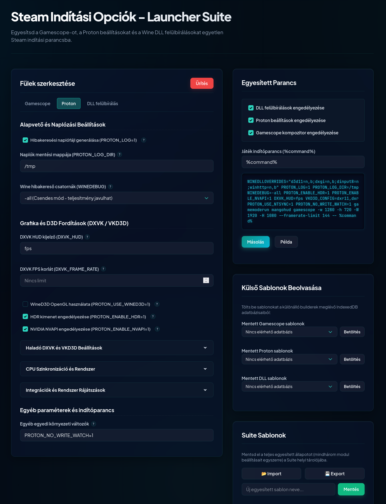
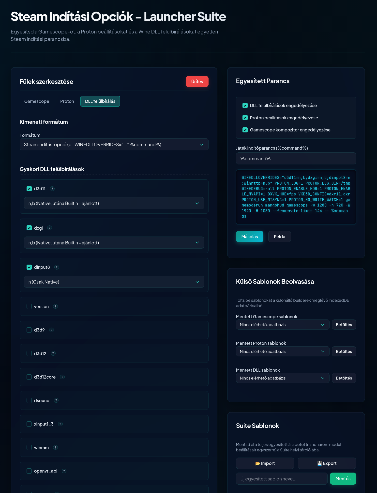
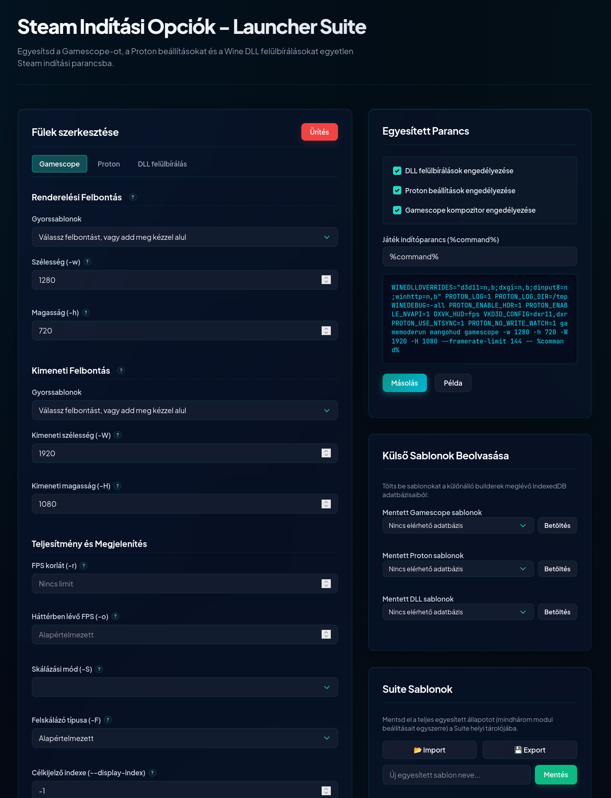

# Linux Gaming Indítási Parancs Szerkesztő Gyűjtemény (Steam Launcher Suite)

Ez a projekt egy modern, kliensoldali webes segédeszköz-gyűjtemény Linuxos játékosok számára. Segítségével könnyen és vizuálisan konfigurálhatók a Steam indítási beállításai (Steam Launch Options), beleértve a **Gamescope** paramétereket, a **Proton** környezeti változóit, valamint a **Wine DLL felülbírálásokat (WINEDLLOVERRIDES)**.

Az alkalmazások teljesen offline módon, közvetlenül a böngészőből futtathatók, nincs szükség szerveroldali háttérre vagy telepítésre.

## 📸 Előnézet

### Steam Launcher Suite (main.html)

### Gamescope Parancskészítő (gamescope_builder_hu.html)

### Proton és Wine DLL beállító (proton_builder_hu.html / winedlloverrides_builder_hu.html)

---

## 🚀 Főbb jellemzők és Felépítés

A gyűjtemény 4 darab önálló, de egymással integrált HTML/JS alkalmazásból és egy közös stíluslapból áll:

### 1. 🎛️ [Steam Launcher Suite (Fő Parancskészítő)](./main.html)
* **Fájl:** `main.html`
* **Leírás:** A projekt központi eleme, amely egyetlen felületen egyesíti a Gamescope-ot, a Proton beállításokat és a Wine DLL felülbírálásokat.
* **Különleges képesség (Preset Merger):** Képes beolvasni a különálló modulokban elmentett sablonokat az IndexedDB-ből, így a felhasználó könnyen egybefésülheti a korábban mentett részkonfigurációit egyetlen végleges Steam indítási parancsba (amely a `%command%` változóval zárul).

### 2. 📺 [Gamescope Parancskészítő](./gamescope_builder_hu.html)
* **Fájl:** `gamescope_builder_hu.html`
* **Leírás:** Kimondottan a Gamescope (a Steam Deck által is használt mikrowindow-manager/compositor) paramétereinek finomhangolására szolgál.
* **Támogatott opciók:**
  - Renderelési (belső) és kimeneti (ablak/monitor) felbontás beállítása népszerű sablonokkal (Steam Deck 1280x800, 1080p, 1440p, 4K, Ultraszéles képarányok).
  - FPS-limitek beállítása fókuszált és háttérbe helyezett állapothoz.
  - Skálázási módok (FSR, NIS, Integer, Stretch, stb.) és AMD FSR élesítés (sharpness) beállítása.
  - Kijelző módok (teljes képernyős, keret nélküli ablak) és egyéb kiegészítő flag-ek (egér elfogás, HDR, Steam Deck integráció).

### 3. ⚙️ [Proton Indítási Opciók Készítő](./proton_builder_hu.html)
* **Fájl:** `proton_builder_hu.html`
* **Leírás:** A Proton és a mögötte álló technológiák (DXVK, VKD3D-Proton, Wine) környezeti változóinak (Environment Variables) grafikus beállítója.
* **Támogatott opciók:**
  - Naplózás aktiválása (`PROTON_LOG=1`).
  - DXVK és VKD3D optimalizációk (pl. shaderek fordításához használt CPU-szálak száma, aszinkron shader fordítás régebbi DXVK verziókhoz).
  - MangoHud (teljesítmény- és FPS-kijelző) egyszerű bekapcsolása.
  - Wine hibakeresési (debug) csatornák szűrése és finomhangolása.
  - Egyéb kompatibilitási és hibaelhárítási flag-ek.

### 4. 🔗 [Wine DLL Felülbírálás Készítő](./winedlloverrides_builder_hu.html)
* **Fájl:** `winedlloverrides_builder_hu.html`
* **Leírás:** Segít összeállítani a `WINEDLLOVERRIDES` környezeti változó értékét, ami elengedhetetlen egyedi modok (pl. GTA, Skyrim mod-loaderek), ReShade (`dxgi`, `d3d11`), ASI injektorok (`dinput8`, `version`) vagy külső könyvtárak betöltéséhez.
* **Támogatott opciók:**
  - Előre definiált gyakori DLL-ek listája magyarázatokkal (pl. `d3d11`, `dxgi`, `dinput8`, `version`, `nvapi64`, stb.).
  - Egyedi DLL-ek hozzáadásának lehetősége.
  - Felülbírálási típusok kezelése: Native (`n`), Builtin (`b`), ezek kombinációi (pl. `n,b`), vagy teljes letiltás (`d`).
  - Kétféle kimeneti formátum: csak a környezeti változó értéke, vagy a komplett Steam-kompatibilis parancs.

---

## 🎨 Dizájn és Felhasználói Élmény

A teljes suite a közös [style.css](./style.css) fájlra épül, amely modern, prémium vizuális megjelenést biztosít:
* **Modern Tipográfia:** Google Fonts-ból betöltött *Plus Jakarta Sans* a felületekhez és *JetBrains Mono* a kód- és parancsmásolókhoz.
* **Harmonikus Sötét Mód (Dark Mode):** Elegáns, sötét tónusú dashboard elrendezés glassmorphism (üveghatású) kártyákkal és finom árnyékokkal.
* **Mikro-animációk:** Interaktív visszajelzések gombokra való rámutatáskor, form-elemek fókuszálásakor és másoláskor.
* **Akadálymentesség és Használhatóság:**
  - Gyorsbillentyűk és ugróhivatkozások (skip links) a billentyűzetes navigáció megkönnyítésére.
  - Beépített súgó ikonok (help tooltips) minden egyes beállítás mellett, amelyek elmagyarázzák, hogy az adott opció mit csinál.
  - Élő parancs-előnézet, ami a beállítások módosításakor azonnal frissül.
  - Egykattintásos vágólapra másolás vizuális visszajelzéssel.

---

## 💾 Sablonok mentése (IndexedDB)

Minden egyes különálló parancskészítő modul rendelkezik egy beépített sablonkezelővel:
* **Helyi Tárolás:** A beállítások a böngésző belső IndexedDB adatbázisába mentődnek el a felhasználó által megadott néven.
* **Biztonság és Adatvédelem:** Az adatok soha nem hagyják el a gépedet, nincs felhőbe küldés.
* **Exportálás / Importálás:** A sablonok JSON formátumban kimenthetők fájlba, és később bármikor visszatölthetők.
* **Integráció:** A fő `main.html` alkalmazás képes megnyitni a `GamescopePresets`, `ProtonPresets` és `WinedlloverridesPresets` nevű adatbázisokat, így a korábban mentett egyedi profilok egyetlen kattintással behúzhatók a kombinált indítóparancsba.

---

## 🛠️ Technológiai Stack

A projekt minimalista és hatékony technológiákra épül:
1. **HTML5:** Strukturált, szemantikus elemek és akadálymentességi attribútumok (ARIA).
2. **Vanilla CSS3:** Nincsenek nehéz CSS keretrendszerek (pl. Tailwind), a reszponzivitás és a flexibilitás teljesen egyedi stílusokkal van megoldva.
3. **Vanilla Javascript (ES6+):** Nulla külső könyvtár (pl. jQuery vagy React), közvetlen DOM manipuláció és aszinkron IndexedDB hívások a maximális sebességért.

---

## 📖 Használati Útmutató

1. Töltsd le a projekt fájljait egy mappába.
2. Nyiss meg bármelyik `.html` kiterjesztésű fájlt a kedvenc böngésződben (pl. Firefox, Chrome, Brave, Edge).
   - *Tipp: Ha az összes beállítást egyszerre szeretnéd kezelni, kezdd a [main.html](./main.html) fájllal.*
3. Állítsd be a kívánt értékeket a csúszkák, checkboxok és beviteli mezők segítségével.
4. Kattintson a kimeneti ablak melletti **Másolás** gombra.
5. Nyisd meg a Steamet, kattints jobb gombbal a kívánt játékra -> **Tulajdonságok... (Properties...)** -> **Általános (General)** fül -> **Indítási opciók (Launch Options)** mező.
6. Illeszd be a vágólapról a kimásolt parancsot (pl. `gamescope -w 1280 -h 800 -W 1920 -H 1080 -f -- PROTON_LOG=1 %command%`).
7. Indítsd el a játékot!
